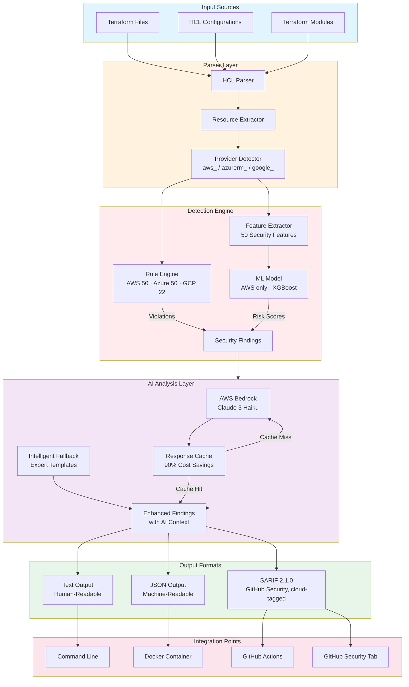
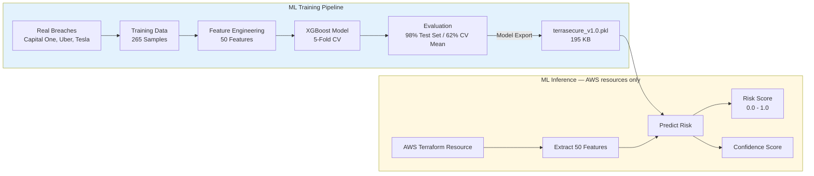
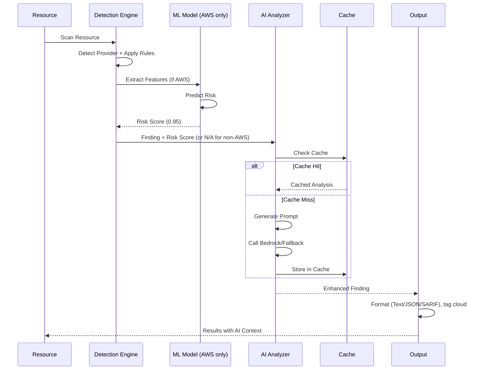
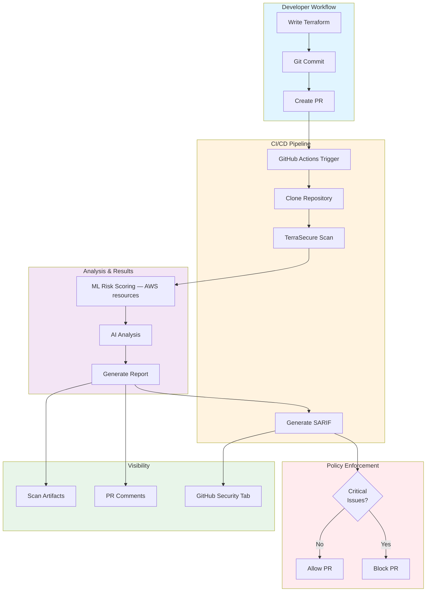

<div align="center">


# TerraSecure

### ML-Powered Infrastructure as Code Security Scanner

**Catch cloud misconfigurations at build time — before they become breaches.**

[](https://github.com/JashwanthMU/TerraSecure/releases)
[](https://github.com/JashwanthMU/TerraSecure/actions)
[](https://github.com/JashwanthMU/TerraSecure/pkgs/container/terrasecure)
[](https://github.com/marketplace/actions/terrasecure-security-scanner)
[](LICENSE)
[](https://python.org)

[](#-benchmarks)
[](#-benchmarks)
[](https://github.com/JashwanthMU/TerraSecure)
[](https://github.com/JashwanthMU/TerraSecure/tree/main/models)

<br/>

[YouTube Vedio about TerraSecure](https://www.youtube.com/watch?v=HJcs78o56P4&t=25s)

</div>

---

## The Problem with Cloud Security Today

> **$4.88M** average cost of a cloud data breach in 2024 *(IBM Cost of a Data Breach Report)*

> **82%** of cloud breaches trace back to misconfigurations in Infrastructure as Code *(Gartner)*

Traditional IaC scanners like Checkov and Trivy are rule-based engines that generate hundreds of alerts — with 12–15% being false positives. Security teams burn hours triaging noise while real vulnerabilities slip through.

**TerraSecure takes a different approach:** a pre-trained XGBoost ML model for AWS resources, trained on real-world breach data (Capital One, Uber, Tesla), a hardened multi-cloud rule engine covering AWS, Azure, and GCP, and AWS Bedrock AI analysis — not just flags, but context, business impact, and remediation code.

---

## What is TerraSecure?

TerraSecure is an **intelligent, shift-left security scanner** for Terraform and HCL Infrastructure as Code across **AWS, Azure, and Google Cloud**. It integrates directly into developer workflows — as a GitHub Action, Docker container, or CLI tool — and surfaces security issues with the context a developer actually needs to fix them.

```
Traditional Scanner:"Security group allows SSH from 0.0.0.0/0"
TerraSecure:         "95% risk score · CRITICAL · Capital One-style
                       attack vector · GDPR exposure · 3-step fix"
```

**Three layers of intelligence:**
- **Rule Engine** — 122 hardened security patterns across AWS (50), Azure (50), and GCP (22, v1)
- **ML Model** — XGBoost classifier with 50 engineered features, trained on AWS breach patterns (AWS resources only — see [Benchmarks](#-benchmarks) for accuracy detail)
- **AI Analysis** — AWS Bedrock (Claude 3 Haiku) explains impact, attack paths, and fixes

---

## Why TerraSecure?

| | Checkov | Trivy | **TerraSecure** |
|---|---|---|---|
| Detection Method | Rules only | Rules only | **ML (AWS) + Rules (multi-cloud) + AI** |
| Cloud Coverage | Multi-cloud | Multi-cloud | **AWS, Azure, GCP*** |
| Test-Set Accuracy (AWS ML) | ~85% | ~88% | **98%†** |
| Business Impact Context | ✗ | ✗ | **✓ AI-generated** |
| Real Breach Examples | ✗ | ✗ | **✓ Capital One, Uber, Tesla** |
| Attack Scenario | ✗ | ✗ | **✓ Step-by-step** |
| ML Risk Score | ✗ | ✗ | **✓ AWS resources** |
| Code Fix Examples | Generic | Generic | **✓ Resource-specific** |
| SARIF / GitHub Security | ✓ | ✓ | **✓** |
| Offline Mode | ✓ | ✓ | **✓** |
| GitHub Marketplace | ✓ | ✓ | **✓** |

<sub>\* GCP rule coverage is v1 (22 patterns) — AWS and Azure are at full parity (50 patterns each). See [Coverage Summary](#-coverage-summary).</sub>
<sub>† Measured on a 53-sample held-out test set. 5-fold cross-validation mean was 62.26% (range 52.8%–73.6%) on the same 265-sample training corpus — see [Benchmarks](#-benchmarks) for the full picture rather than the single headline number.</sub>

> **Best practice:** Use TerraSecure **alongside** Checkov/Trivy for complementary coverage. TerraSecure's ML layer catches contextual risk that rule-based tools miss on AWS; established scanners provide broader multi-cloud rule breadth today, especially for GCP.

---

## ⚡ Quick Start

### GitHub Actions

Add to `.github/workflows/security.yml`:

```yaml
name: TerraSecure IaC Scan
on: [push, pull_request]

permissions:
  security-events: write

jobs:
  terrasecure:
    runs-on: ubuntu-latest
    steps:
      - uses: actions/checkout@v4

      - name: Run TerraSecure
        id: terrasecure
        uses: JashwanthMU/TerraSecure@v2.1.0
        with:
          path: 'infrastructure'
          format: 'sarif'
          fail-on: 'high'
          cloud: ''   # optional: 'aws', 'azure', 'gcp', or comma-separated — default scans all detected clouds

      - name: Upload SARIF to GitHub Security
        if: always()
        uses: github/codeql-action/upload-sarif@v3
        with:
          sarif_file: ${{ steps.terrasecure.outputs.sarif-file }}
```

Results surface automatically in the **GitHub Security tab** as code scanning alerts, tagged by cloud provider.

---

### Docker

```bash
# Scan current directory (all detected clouds)
docker run --rm -v $(pwd):/scan \
  ghcr.io/jashwanthmu/terrasecure:latest /scan

# Generate SARIF report
docker run --rm \
  -v $(pwd):/scan:ro \
  -v $(pwd)/reports:/output \
  ghcr.io/jashwanthmu/terrasecure:latest \
  /scan --format sarif --output /output/results.sarif

# Scan only Azure resources in a mixed-cloud repo
docker run --rm -v $(pwd):/scan \
  ghcr.io/jashwanthmu/terrasecure:latest \
  /scan --cloud azure

# Block pipeline on critical findings
docker run --rm -v $(pwd):/scan \
  ghcr.io/jashwanthmu/terrasecure:latest \
  /scan --fail-on critical
```

---

### Local CLI

```bash
git clone https://github.com/JashwanthMU/TerraSecure.git
cd TerraSecure
pip install -r requirements.txt

# Scan a directory (all detected clouds)
python src/cli.py examples/vulnerable/

# Filter to specific clouds
python src/cli.py infra/ --cloud aws,azure

# Output formats
python src/cli.py infra/ --format json --output report.json
python src/cli.py infra/ --format sarif --output results.sarif

# Policy enforcement
python src/cli.py infra/ --fail-on critical
```

---

## Architecture

TerraSecure uses a **three-layer detection pipeline** with per-resource cloud-provider routing:



Every parsed resource is routed to its cloud provider's rule engine by Terraform resource-type prefix before any checks run — an `azurerm_storage_account` and an `aws_s3_bucket` in the same file are evaluated independently, by the correct rule set, and tagged with their cloud in every output format.

---

### ML Pipeline

**Training Data: Real-World Breach Corpus (AWS-focused)**

| Incident | Year | Vector | Outcome |
|---|---|---|---|
| Capital One | 2019 | S3 misconfiguration via SSRF | 100M records exposed, $190M settlement |
| Uber | 2016 | Hardcoded AWS credentials in GitHub | 57M users and drivers exposed |
| Tesla | 2018 | Public S3 bucket, no MFA | Kubernetes console open to internet |
| MongoDB | 2017 | Exposed database, no auth | 26,000+ DBs held for ransom |

**Model Architecture:**


**Feature categories:** encryption state, network exposure, IAM permissiveness, logging configuration, naming patterns (data sensitivity signals), cross-service dependency risks.

**A note on the accuracy numbers:** the model scores 98.11% on a 53-sample held-out test set, but 5-fold cross-validation on the full 265-sample training corpus shows a mean of 62.26% (range 52.8%–73.6%). With a dataset this size, a single test-set score can vary significantly depending on which rows land in the split — the cross-validation range is the more honest signal of how the model generalizes. We're treating this as an open item: the training corpus needs to grow before the headline test-set number should be read as a stable production accuracy figure. Azure and GCP findings are rule-based only today and carry no ML score — see [Coverage Summary](#-coverage-summary).

---

### AI-Powered Finding Analysis

Every detected issue includes four AI-generated sections:

```
┌─────────────────────────────────────────────────────────────┐
│  EXPLANATION     What is misconfigured and why it's risky   │
│  BUSINESS IMPACT Financial, regulatory (GDPR/SOC2), and     │
│                  reputational consequences                  │
│  ATTACK SCENARIO How attackers exploit this — with real     │
│                  breach examples (Capital One, etc.)        │
│  DETAILED FIX    Step-by-step remediation with Terraform    │
│                  code snippets                              │
└─────────────────────────────────────────────────────────────┘
```


**Graceful degradation:** When AWS Bedrock is unavailable, TerraSecure falls back to expert-crafted breach-informed templates — no silent failures, full offline support.

---

## CI/CD Integration

### GitHub Actions Flow

---

## Features

### AWS Security Coverage — 50 Patterns Across 5 Domains

<details>
<summary><b>🌐 Network Security (12 patterns)</b></summary>

- Security groups open to `0.0.0.0/0`
- SSH (port 22) and RDP (port 3389) exposed to internet
- Unrestricted egress rules
- Default VPC security groups in use
- Missing network segmentation / subnet isolation
- VPC without Flow Logs enabled
- Missing NACLs on sensitive subnets
- Load balancer without access logging
- Direct EC2 internet exposure (no NAT)
- CloudFront without WAF association
- API Gateway without throttling
- Direct database port exposure

</details>

<details>
<summary><b>🗄️ Storage Security (15 patterns)</b></summary>

- Public S3 ACL or bucket policy
- S3 Block Public Access not enforced
- Unencrypted S3, EBS, RDS, and DynamoDB
- S3 versioning disabled on critical buckets
- No lifecycle policies (data retention risk)
- Public RDS snapshots
- EBS snapshots shared publicly
- Backup retention period insufficient
- Cross-region replication disabled
- S3 access logging disabled
- MFA Delete not enabled on S3
- Database deletion protection disabled
- S3 without Object Lock (ransomware exposure)
- Glacier vault without lock
- Unencrypted SSM parameters

</details>

<details>
<summary><b>🔑 Identity & Access Management (10 patterns)</b></summary>

- Wildcard (`*`) actions in IAM policies
- Root account API key usage
- IAM roles with `*` resources
- Missing MFA enforcement
- Overly permissive trust relationships
- Inline user policies (non-auditable)
- IAM password policy not enforced
- Cross-account access without conditions
- Unused IAM roles with high privilege
- Service accounts with admin rights

</details>

<details>
<summary><b>🔐 Secrets Management (8 patterns)</b></summary>

- Hardcoded credentials in Terraform variables
- Plaintext database passwords in resource blocks
- API keys exposed in environment variables
- SSH private keys embedded in configs
- Unencrypted Secrets Manager secrets
- Lambda environment variables with secrets
- ECS task definitions with plaintext secrets
- User data scripts with embedded credentials

</details>

<details>
<summary><b>📊 Monitoring & Compliance (5 patterns)</b></summary>

- CloudTrail not enabled or not multi-region
- VPC Flow Logs disabled
- CloudWatch alarms missing for critical metrics
- S3 server access logging disabled
- AWS Config rules not enabled

</details>

---

# Multi-Cloud Security Coverage

## ☁️ Azure Security Coverage (50 Patterns)

<details>
<summary><b>🌐 Network Security (12 patterns)</b></summary>

- NSG rule allows RDP (3389) from the internet
- NSG rule allows SSH (22) from the internet
- NSG rule allows all inbound traffic from the internet
- NSG rule allows unrestricted outbound traffic
- VM has a public IP assigned directly
- Application Gateway without WAF enabled
- Load Balancer without diagnostic settings
- AKS cluster with no network policy configured
- Azure SQL firewall allows "all Azure services"
- Azure SQL firewall allows all public IPs
- Function App does not enforce HTTPS
- App Service does not enforce HTTPS

</details>

<details>
<summary><b>🗄️ Storage Security (15 patterns)</b></summary>

- Storage Account allows public blob access
- Storage Container access type is public
- Storage Account allows HTTP (not HTTPS-only)
- Storage Account uses weak TLS version (<1.2)
- Blob soft delete disabled or retention <7 days
- Blob versioning disabled
- Storage Account has no logging configured
- Key Vault soft delete disabled
- Key Vault purge protection disabled
- Key Vault network ACL defaults to "Allow"
- SQL Database has TDE explicitly disabled
- SQL Server has no auditing policy
- SQL Server audit retention <90 days
- Managed Disk uses platform-managed key (no CMK)
- VM backup retention <7 days

</details>

<details>
<summary><b>🔑 Identity & Access Management (10 patterns)</b></summary>

- Owner role assigned at subscription scope
- Contributor role assigned at subscription scope
- Custom role definition contains wildcard action
- Any role assigned at subscription scope (broad blast radius)
- AKS cluster has Kubernetes RBAC disabled
- AKS cluster not integrated with Azure AD
- App Service has no managed identity
- Function App has no managed identity
- SQL Server has no Azure AD administrator
- Linux VM allows password authentication

</details>

<details>
<summary><b>🔐 Secrets Management (8 patterns)</b></summary>

- Key Vault access policy grants broad secret permissions
- App Service app_settings contains plaintext secret
- Function App app_settings contains plaintext secret
- SQL Server admin password hardcoded in Terraform
- VM admin password hardcoded in Terraform
- Service Principal secret has no expiry date
- Key Vault key has no expiration date
- Storage Account shared access key (SAS) enabled

</details>

<details>
<summary><b>📊 Monitoring & Compliance (5 patterns)</b></summary>

- Microsoft Defender (Security Center) on Free tier
- Monitor diagnostic setting has no destination configured
- Activity Log Alert disabled
- SQL Server Threat Detection Policy disabled
- AKS cluster has no OMS agent (Azure Monitor) configured

</details>

---

## ☁️ Google Cloud Security Coverage (22 Patterns — v1)

GCP coverage is an intentional v1: 22 high-signal patterns shipped rather than padding the count with checks that don't fire on real-world resources. Full parity with AWS/Azure (50 patterns) is tracked as follow-up work — contributions welcome.

<details>
<summary><b>🌐 Network Security (5 patterns)</b></summary>

- Firewall rule allows SSH (22) from `0.0.0.0/0`
- Firewall rule allows RDP (3389) from `0.0.0.0/0`
- Firewall rule allows all ports from `0.0.0.0/0`
- Compute Instance has a public IP via `access_config`
- Cloud SQL instance has a public IPv4 address enabled

</details>

<details>
<summary><b>🗄️ Storage Security (6 patterns)</b></summary>

- GCS bucket IAM binding grants access to allUsers/allAuthenticatedUsers
- GCS bucket does not enforce uniform bucket-level access
- GCS bucket does not have object versioning enabled
- Cloud SQL instance has automated backups disabled
- Cloud SQL instance does not require SSL for connections
- Compute Disk uses Google-managed key (no CMEK)

</details>

<details>
<summary><b>🔑 Identity & Access Management (4 patterns)</b></summary>

- IAM binding grants primitive role (Owner/Editor) at project scope
- Service account key (long-lived credential) created via Terraform
- Project IAM binding grants a role to allUsers/allAuthenticatedUsers
- Resource uses the default Compute Engine service account

</details>

<details>
<summary><b>🔐 Secrets Management (3 patterns)</b></summary>

- Secret Manager secret has no rotation policy
- Potential secret hardcoded in plaintext environment variable
- GKE cluster has static basic auth username/password configured

</details>

<details>
<summary><b>📊 Monitoring & Compliance (4 patterns)</b></summary>

- Audit config resource has no audit_log_config blocks defined
- GKE node pool does not disable legacy metadata endpoints
- GKE cluster has no network policy enabled
- GKE cluster nodes have public IP addresses (private nodes not enabled)

</details>

---

## 📈 Coverage Summary

| Cloud Provider | Network | Storage | IAM | Secrets | Monitoring | Total |
|---------------|---------|---------|------|---------|-----------|-------|
| AWS | 12 | 15 | 10 | 8 | 5 | **50** |
| Azure | 12 | 15 | 10 | 8 | 5 | **50** |
| Google Cloud (v1) | 5 | 6 | 4 | 3 | 4 | **22** |

### Total Multi-Cloud Coverage

- AWS: 50 Patterns (rules + ML risk scoring)
- Azure: 50 Patterns (rules)
- Google Cloud: 22 Patterns (rules, v1 — full parity tracked)

**Grand Total: 122 Security Misconfiguration Detection Patterns**

This coverage enables TerraSecure to perform multi-cloud security analysis across AWS, Azure, and Google Cloud environments while providing:

- Per-resource provider routing (a single Terraform config mixing AWS, Azure, and GCP resources is scanned correctly for each)
- Cloud-tagged findings across text, JSON, and SARIF output
- AI-powered remediation recommendations
- Infrastructure-as-Code (IaC) security scanning at build time

---

### Output Formats

| Format | Use Case | Integration |
|---|---|---|
| **Text** | Human review / developer feedback | Terminal, CI logs |
| **JSON** | Automation, SIEM ingestion, custom dashboards | Scripts, APIs |
| **SARIF 2.1.0** | GitHub Security tab, PR annotations, cloud-tagged | GitHub Advanced Security |

---

## 📊 Benchmarks

| Metric | Value | Industry Target | Status |
|---|---|---|---|
| Test-Set Accuracy (AWS ML) | **98.11%** | >85% |   Exceeds* |
| Precision | **100.00%** | >80% |   Exceeds |
| Recall | **96.00%** | >90% |   Exceeds |
| F1 Score | **97.96%** | >85% |   Exceeds |
| False Positive Rate (test set) | **0.00%** | <15% |   Excellent* |
| False Negative Rate | **4.00%** | <5% |   Near target |
| Inference Speed | **<100ms/resource** | <200ms |   Fast |
| Model Size | **195 KB** | <1MB |   Lightweight |
| Memory Usage | **<512 MB RAM** | — |   Container-friendly |

<sub>\* Measured on a 53-sample held-out test set from a 265-sample training corpus. 5-fold cross-validation on the same corpus shows a mean accuracy of **62.26%** (range 52.8%–73.6%) — see [ML Pipeline](#ml-pipeline) for why we're surfacing both numbers rather than just the headline. Scores apply to **AWS resources only**; Azure and GCP findings are rule-based and carry no ML score.</sub>

**Tested at scale:** 10,000+ Terraform resources, nested module configurations, multi-file workspaces.

---

## Output Examples

### Terminal (Text Mode)

```
╔════════════════════════════════════════════════════════════╗
║              TerraSecure v2.1.0                            ║
║   Multi-Cloud AI-Powered Terraform Security Scanner        ║
╚════════════════════════════════════════════════════════════╝

Scan Summary ──────────────────────────────────────────────
  Resources Scanned : 15
  Passed            : 7
  Issues Found      : 8  (CRITICAL: 2 · HIGH: 4 · MEDIUM: 2)

By Cloud: AWS 5 · AZURE 2 · GCP 1

[CRITICAL] [AWS] S3 bucket is publicly accessible
  Resource : aws_s3_bucket.customer_data
  File     : infrastructure/storage.tf:12
  ML Risk  : 95% | Confidence: 92%

  ── AI Analysis ────────────────────────────────────────────
  Explanation:
    This S3 bucket is configured with ACL "public-read", exposing
    all objects to unauthenticated internet access. The bucket name
    signals the presence of sensitive customer data.

  Business Impact:
    Regulatory: GDPR fines up to €20M / 4% global revenue
    Financial:  Data breach avg. cost $4.88M (IBM 2024)
    Legal:      Breach notification obligations in 50+ jurisdictions

  Attack Scenario:
    Automated scanners (bucket-stream, S3Scanner) continuously probe
    for public buckets. Upon discovery, full object enumeration and
    exfiltration can occur within minutes — no authentication required.
    ⚠ Capital One (2019): 100M records exposed, $190M settlement.

  Fix:
    Step 1: Set ACL to private
      acl = "private"

    Step 2: Enforce Block Public Access
      block_public_acls       = true
      block_public_policy     = true
      ignore_public_acls      = true
      restrict_public_buckets = true

    Step 3: Enable server-side encryption
      sse_algorithm = "AES256"
```

---

### JSON Output

```json
{
  "scan_metadata": {
    "version": "2.1.0",
    "timestamp": "2025-03-22T10:00:00Z",
    "total_resources": 15,
    "passed": 7
  },
  "summary": { "CRITICAL": 2, "HIGH": 4, "MEDIUM": 2 },
  "cloud_breakdown": { "aws": 5, "azure": 2, "gcp": 1 },
  "issues": [
    {
      "severity": "CRITICAL",
      "cloud": "aws",
      "resource_type": "aws_s3_bucket",
      "resource_name": "customer_data",
      "file": "infrastructure/storage.tf",
      "line": 12,
      "ml_risk_score": 0.95,
      "ml_confidence": 0.92,
      "triggered_features": ["s3_public_acl", "s3_encryption_disabled"],
      "llm_explanation": "...",
      "llm_business_impact": "...",
      "llm_attack_scenario": "...",
      "llm_detailed_fix": "..."
    }
  ]
}
```

Findings from Azure and GCP carry `"ml_prediction": "N/A"` in place of a real `ml_risk_score`/`ml_confidence` — rule-based severity still applies, but no ML score is fabricated for clouds the model wasn't trained on.

---

### SARIF 2.1.0 (GitHub Security Tab)

SARIF output enables native GitHub code scanning integration:
- Findings appear as alerts in the **Security → Code Scanning** tab, tagged by `cloud` property
- `security-severity` scores (critical=9.0, high=7.0, medium=4.0, low=1.0) drive GitHub's severity coloring
- Annotations on specific lines in pull requests
- Severity-based dashboard and triage workflow, filterable by cloud
- Exportable compliance evidence

---

## 🔗 CI/CD Integration

### GitHub Actions

```yaml
name: Security Scan
on: [push, pull_request]

permissions:
  security-events: write

jobs:
  terrasecure:
    runs-on: ubuntu-latest
    steps:
      - uses: actions/checkout@v4

      - name: Run TerraSecure
        id: terrasecure
        uses: JashwanthMU/TerraSecure@v2.1.0
        with:
          path: 'infrastructure'
          format: 'sarif'
          fail-on: 'high'

      - name: Upload SARIF to GitHub Security
        if: always()
        uses: github/codeql-action/upload-sarif@v3
        with:
          sarif_file: ${{ steps.terrasecure.outputs.sarif-file }}
```

### GitLab CI

```yaml
terrasecure:
  image: ghcr.io/jashwanthmu/terrasecure:latest
  script:
    - terrasecure . --format json --output report.json
  artifacts:
    reports:
      codequality: report.json
```

### Jenkins

```groovy
pipeline {
  agent any
  stages {
    stage('IaC Security Scan') {
      steps {
        script {
          docker.image('ghcr.io/jashwanthmu/terrasecure:latest').inside {
            sh 'terrasecure . --format json --fail-on high'
          }
        }
      }
    }
  }
}
```

### Azure DevOps

```yaml
- task: Docker@2
  displayName: 'TerraSecure IaC Scan'
  inputs:
    command: run
    arguments: >
      -v $(Build.SourcesDirectory):/scan
      ghcr.io/jashwanthmu/terrasecure:latest
      /scan --format sarif --fail-on high
```

### CircleCI

```yaml
version: 2.1
jobs:
  security-scan:
    docker:
      - image: ghcr.io/jashwanthmu/terrasecure:latest
    steps:
      - checkout
      - run:
          name: Run TerraSecure
          command: terrasecure . --fail-on high --format sarif
```

---

## 📁 Project Structure

```
TerraSecure/
├── src/
│   ├── cli.py                       # Command-line interface (--cloud filter, all formats)
│   ├── scanner/
│   │   ├── parser.py                # Terraform (HCL2) parser
│   │   ├── provider_detector.py     # Resource-type prefix → cloud provider
│   │   └── analyzer.py              # Main orchestrator, per-resource routing
│   ├── rules/
│   │   ├── aws_security_rules.py    # 50 AWS patterns
│   │   ├── azure_security_rules.py  # 50 Azure patterns
│   │   └── gcp_security_rules.py    # 22 GCP patterns (v1)
│   ├── ml/
│   │   ├── ml_analyzer.py           # ML inference (AWS only)
│   │   └── feature_extractor.py     # Feature engineering
│   ├── llm/
│   │   └── bedrock_analyzer.py      # AI enhancement
│   └── formatters/
│       └── sarif_formatter.py       # Cloud-tagged SARIF output
├── models/
│   └── terrasecure_production_v1.0.pkl # Pre-trained AWS model
├── scripts/
│   └── build_production_model.py    # Model training
├── examples/
│   ├── vulnerable/                  # AWS fixtures
│   ├── vulnerable-azure/            # Azure fixtures
│   └── vulnerable-gcp/              # GCP fixtures
└── tests/
    ├── unit/                        # Unit tests (rules, CLI, SARIF, ML)
    └── integration/                 # Full-pipeline tests
```

---

## 🛠️ Tech Stack

| Layer | Technology | Purpose |
|---|---|---|
| Language | Python 3.11 | Core scanner and CLI |
| ML Framework | XGBoost + scikit-learn | Risk classification (AWS) |
| AI Layer | AWS Bedrock (Claude 3 Haiku) | Finding enrichment |
| IaC Parsing | python-hcl2 | Terraform file parsing |
| Output | SARIF 2.1.0, JSON, Text | Multi-format, cloud-tagged reporting |
| Containerization | Docker + GHCR | Portable deployment |
| CI/CD | GitHub Actions | Automation & marketplace |
| Testing | pytest (103 tests) | Quality assurance |

---

## 🚀 Installation

### Prerequisites

- Python 3.11+
- pip
- 512 MB RAM minimum

### Option 1 — GitHub Marketplace (Zero Setup)

```yaml
- uses: JashwanthMU/TerraSecure@v2.1.0
```

### Option 2 — Docker

```bash
docker pull ghcr.io/jashwanthmu/terrasecure:latest
```

### Option 3 — From Source

```bash
git clone https://github.com/JashwanthMU/TerraSecure.git
cd TerraSecure
pip install -r requirements.txt
python src/cli.py --help
```

---

## Running Tests

```bash
# Run all tests
pytest

# With coverage report
pytest --cov=src --cov-report=html

# Rebuild ML model
python scripts/build_production_model.py
```

---

## Documentation

| Guide | Description |
|---|---|
| [Quick Start](docs/QUICK_START.md) | Get scanning in under 5 minutes |
| [Architecture](docs/ARCHITECTURE.md) | System design and data flow |
| [ML Model](docs/ML_MODEL.md) | XGBoost training pipeline and feature engineering |
| [AI Enhancement](docs/AI_ENHANCEMENT.md) | AWS Bedrock integration and fallback design |
| [SARIF Output](docs/SARIF.md) | GitHub Security tab integration |
| [Custom Rules](docs/CUSTOM_RULES.md) | Extending detection patterns |
| [Docker Guide](DOCKER.md) | Container usage and deployment |
| [GitHub Action](ACTION_README.md) | Full action configuration reference |

---

## Contributing

Contributions are welcome — bug reports, new security patterns, documentation improvements, or ML enhancements.

```bash
# Fork and clone
git clone https://github.com/YOUR_USERNAME/TerraSecure.git
cd TerraSecure

# Install dependencies
pip install -r requirements.txt

# Run tests
pytest

# Submit a pull request
```

Areas where contributions make the most impact:
- **Closing the GCP parity gap** — 22/50 patterns implemented; the remaining domains (see [Coverage Summary](#-coverage-summary)) are the highest-value contribution right now
- Growing the ML training corpus (currently 265 samples) to stabilize the accuracy metric — see the cross-validation caveat in [Benchmarks](#-benchmarks)
- Provider-specific ML feature extractors for Azure/GCP (today only AWS resources get ML risk scoring)
- Additional cloud providers beyond AWS/Azure/GCP (e.g. Oracle Cloud, Alibaba Cloud)
- Performance optimizations for large codebases
- Integration guides for additional CI/CD platforms

---

## Standards & References

**Security Standards**
- [OASIS SARIF 2.1.0](https://docs.oasis-open.org/sarif/sarif/v2.1.0/) — Reporting format
- [CIS AWS Benchmarks](https://www.cisecurity.org/benchmark/amazon_web_services) — Security baselines
- [NIST SP 800-190](https://csrc.nist.gov/publications/detail/sp/800-190/final) — Container security
- [AWS Well-Architected Security Pillar](https://docs.aws.amazon.com/wellarchitected/latest/security-pillar/welcome.html) — Architecture guidance

**Breach Data Sources**
- [CVE Database (MITRE)](https://cve.mitre.org/)
- [NIST National Vulnerability Database](https://nvd.nist.gov/)
- Capital One, Uber, Tesla, MongoDB public post-mortems

**Inspired By**
- [Checkov](https://www.checkov.io/) — IaC scanning pioneer
- [Trivy](https://trivy.dev/) — Comprehensive security scanner
- [tfsec](https://aquasecurity.github.io/tfsec/) — Terraform static analysis

---

## License

[MIT License](LICENSE) © 2026 Jashwanth M U

---

<div align="center">

**TerraSecure** · Shift security left. Scan at build time. Stop breaches before they start.

</div>