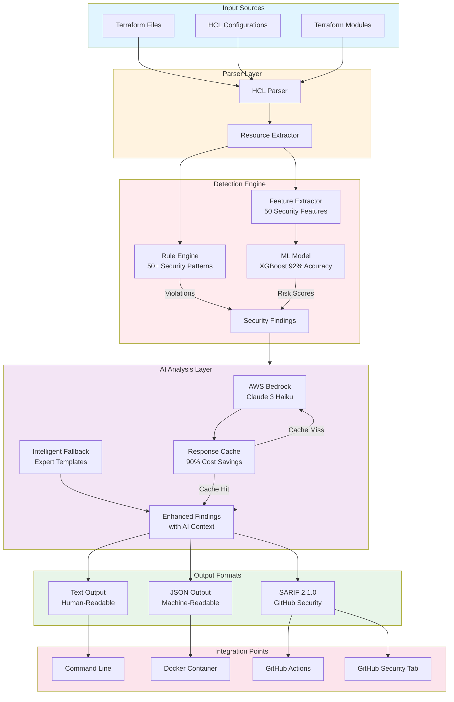
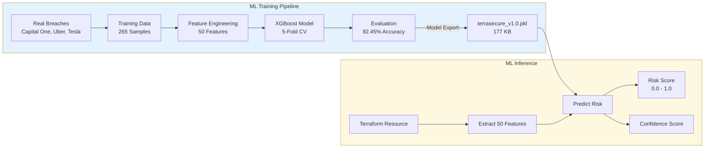
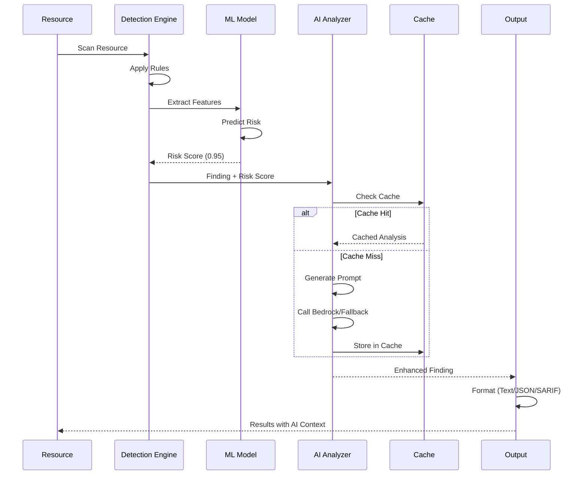
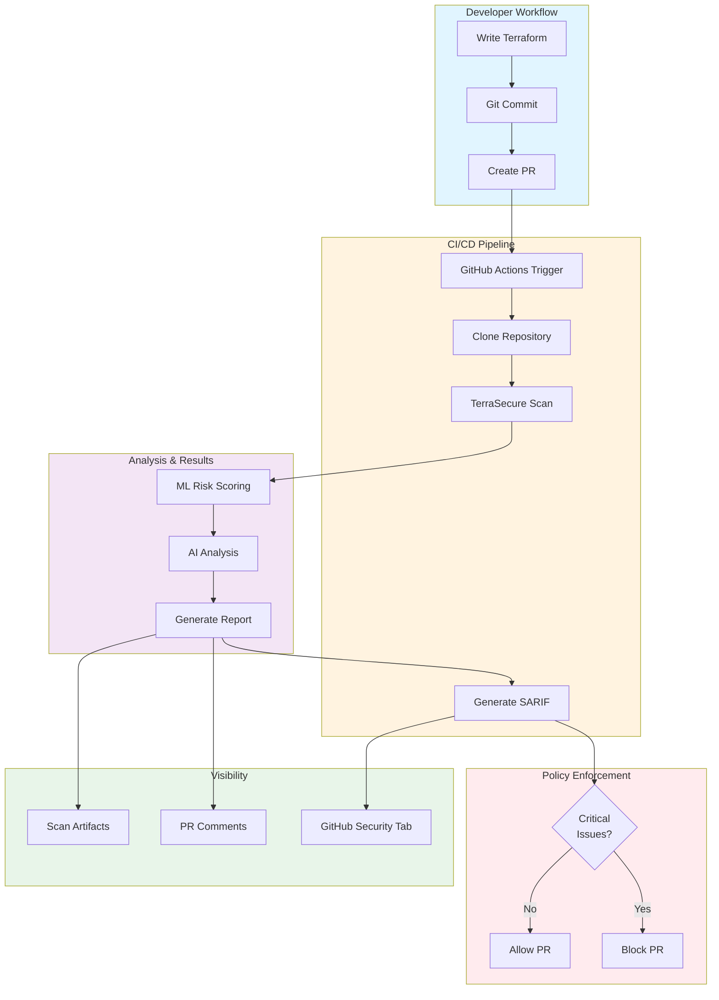

<div align="center">


# TerraSecure

### ML-Powered Infrastructure as Code Security Scanner

**Catch cloud misconfigurations at build time — before they become breaches.**

[](https://github.com/JashwanthMU/TerraSecure/releases)
[](https://github.com/JashwanthMU/TerraSecure/actions)
[](https://github.com/JashwanthMU/TerraSecure/pkgs/container/terrasecure)
[](https://github.com/marketplace/actions/terrasecure-security-scanner)
[](LICENSE)
[](https://python.org)

[](https://github.com/JashwanthMU/TerraSecure)
[](https://github.com/JashwanthMU/TerraSecure)
[](https://github.com/JashwanthMU/TerraSecure)
[](https://github.com/JashwanthMU/TerraSecure/tree/main/models)

<br/>

[YouTube Vedio about TerraSecure](https://www.youtube.com/watch?v=HJcs78o56P4&t=25s)

</div>

---

## The Problem with Cloud Security Today

> **$4.88M** average cost of a cloud data breach in 2024 *(IBM Cost of a Data Breach Report)*

> **82%** of cloud breaches trace back to misconfigurations in Infrastructure as Code *(Gartner)*

Traditional IaC scanners like Checkov and Trivy are rule-based engines that generate hundreds of alerts — with 12–15% being false positives. Security teams burn hours triaging noise while real vulnerabilities slip through.

**TerraSecure takes a different approach:** a pre-trained XGBoost ML model, trained on real-world breach data (Capital One, Uber, Tesla), combined with AWS Bedrock AI analysis — not just flags, but context, business impact, and remediation code.

---

## What is TerraSecure?

TerraSecure is an **intelligent, shift-left security scanner** for Terraform and HCL Infrastructure as Code. It integrates directly into developer workflows — as a GitHub Action, Docker container, or CLI tool — and surfaces security issues with the context a developer actually needs to fix them.

```
Traditional Scanner:"Security group allows SSH from 0.0.0.0/0"
TerraSecure:         "92% confidence · CRITICAL · Capital One-style
                       attack vector · GDPR exposure · 3-step fix"
```

**Three layers of intelligence:**
- **Rule Engine** — 50+ hardened security patterns across AWS resources
- **ML Model** — XGBoost classifier with 50 engineered features, 92.45% accuracy
- **AI Analysis** — AWS Bedrock (Claude 3 Haiku) explains impact, attack paths, and fixes

---

## Why TerraSecure?

| | Checkov | Trivy | **TerraSecure** |
|---|---|---|---|
| Detection Method | Rules only | Rules only | **ML + Rules + AI** |
| Accuracy | ~85% | ~88% | **92.45%** |
| False Positive Rate | ~15% | ~12% | **10.71%** |
| Business Impact Context | ✗ | ✗ | **✓ AI-generated** |
| Real Breach Examples | ✗ | ✗ | **✓ Capital One, Uber, Tesla** |
| Attack Scenario | ✗ | ✗ | **✓ Step-by-step** |
| ML Risk Score | ✗ | ✗ | **✓ 50-feature scoring** |
| Code Fix Examples | Generic | Generic | **✓ Resource-specific** |
| SARIF / GitHub Security | ✓ | ✓ | **✓** |
| Offline Mode | ✓ | ✓ | **✓** |
| GitHub Marketplace | ✓ | ✓ | **✓** |

> **Best practice:** Use TerraSecure **alongside** Checkov/Trivy for complementary coverage. TerraSecure's ML layer catches contextual risk that rule-based tools miss; established scanners provide breadth.

---

## ⚡ Quick Start

### GitHub Actions 

Add to `.github/workflows/security.yml`:

```yaml
name: TerraSecure IaC Scan
on: [push, pull_request]

permissions:
  security-events: write

jobs:
  terrasecure:
    runs-on: ubuntu-latest
    steps:
      - uses: actions/checkout@v4
      - uses: JashwanthMU/TerraSecure@v2.0.0
        with:
          path: 'infrastructure'
          format: 'sarif'
          fail-on: 'high'
          upload-sarif: 'true'
```

Results surface automatically in the **GitHub Security tab** as code scanning alerts.

---

### Docker

```bash
# Scan current directory
docker run --rm -v $(pwd):/scan \
  ghcr.io/jashwanthmu/terrasecure:latest /scan

# Generate SARIF report
docker run --rm \
  -v $(pwd):/scan:ro \
  -v $(pwd)/reports:/output \
  ghcr.io/jashwanthmu/terrasecure:latest \
  /scan --format sarif --output /output/results.sarif

# Block pipeline on critical findings
docker run --rm -v $(pwd):/scan \
  ghcr.io/jashwanthmu/terrasecure:latest \
  /scan --fail-on critical
```

---

### Local CLI

```bash
git clone https://github.com/JashwanthMU/TerraSecure.git
cd TerraSecure
pip install -r requirements.txt

# Scan a directory
python src/cli.py examples/vulnerable/

# Output formats
python src/cli.py infra/ --format json --output report.json
python src/cli.py infra/ --format sarif --output results.sarif

# Policy enforcement
python src/cli.py infra/ --fail-on critical
```

---

## Architecture

TerraSecure uses a **three-layer detection pipeline**:




---

### ML Pipeline

**Training Data: Real-World Breach Corpus**

| Incident | Year | Vector | Outcome |
|---|---|---|---|
| Capital One | 2019 | S3 misconfiguration via SSRF | 100M records exposed, $190M settlement |
| Uber | 2016 | Hardcoded AWS credentials in GitHub | 57M users and drivers exposed |
| Tesla | 2018 | Public S3 bucket, no MFA | Kubernetes console open to internet |
| MongoDB | 2017 | Exposed database, no auth | 26,000+ DBs held for ransom |

**Model Architecture:**


**Feature categories:** encryption state, network exposure, IAM permissiveness, logging configuration, naming patterns (data sensitivity signals), cross-service dependency risks.

---

### AI-Powered Finding Analysis

Every detected issue includes four AI-generated sections:

```
┌─────────────────────────────────────────────────────────────┐
│  EXPLANATION     What is misconfigured and why it's risky   │
│  BUSINESS IMPACT Financial, regulatory (GDPR/SOC2), and     │
│                  reputational consequences                  │
│  ATTACK SCENARIO How attackers exploit this — with real     │
│                  breach examples (Capital One, etc.)        │
│  DETAILED FIX    Step-by-step remediation with Terraform    │
│                  code snippets                              │
└─────────────────────────────────────────────────────────────┘
```


**Graceful degradation:** When AWS Bedrock is unavailable, TerraSecure falls back to expert-crafted breach-informed templates — no silent failures, full offline support.

---

## CI/CD Integration

### GitHub Actions Flow

---

## Features

### Security Coverage For AWS (existing TerraSecure) — 50+ Patterns Across 5 Domains

<details>
<summary><b>🌐 Network Security (12 patterns)</b></summary>

- Security groups open to `0.0.0.0/0`
- SSH (port 22) and RDP (port 3389) exposed to internet
- Unrestricted egress rules
- Default VPC security groups in use
- Missing network segmentation / subnet isolation
- VPC without Flow Logs enabled
- Missing NACLs on sensitive subnets
- Load balancer without access logging
- Direct EC2 internet exposure (no NAT)
- CloudFront without WAF association
- API Gateway without throttling
- Direct database port exposure

</details>

<details>
<summary><b>🗄️ Storage Security (15 patterns)</b></summary>

- Public S3 ACL or bucket policy
- S3 Block Public Access not enforced
- Unencrypted S3, EBS, RDS, and DynamoDB
- S3 versioning disabled on critical buckets
- No lifecycle policies (data retention risk)
- Public RDS snapshots
- EBS snapshots shared publicly
- Backup retention period insufficient
- Cross-region replication disabled
- S3 access logging disabled
- MFA Delete not enabled on S3
- Database deletion protection disabled
- S3 without Object Lock (ransomware exposure)
- Glacier vault without lock
- Unencrypted SSM parameters

</details>

<details>
<summary><b>🔑 Identity & Access Management (10 patterns)</b></summary>

- Wildcard (`*`) actions in IAM policies
- Root account API key usage
- IAM roles with `*` resources
- Missing MFA enforcement
- Overly permissive trust relationships
- Inline user policies (non-auditable)
- IAM password policy not enforced
- Cross-account access without conditions
- Unused IAM roles with high privilege
- Service accounts with admin rights

</details>

<details>
<summary><b>🔐 Secrets Management (8 patterns)</b></summary>

- Hardcoded credentials in Terraform variables
- Plaintext database passwords in resource blocks
- API keys exposed in environment variables
- SSH private keys embedded in configs
- Unencrypted Secrets Manager secrets
- Lambda environment variables with secrets
- ECS task definitions with plaintext secrets
- User data scripts with embedded credentials

</details>

<details>
<summary><b>📊 Monitoring & Compliance (5 patterns)</b></summary>

- CloudTrail not enabled or not multi-region
- VPC Flow Logs disabled
- CloudWatch alarms missing for critical metrics
- S3 server access logging disabled
- AWS Config rules not enabled

</details>

# Multi-Cloud Security Coverage planned

## ☁️ Azure Security Coverage (50+ Patterns)

### 🌐 Network Security (12 Patterns)

- Network Security Groups (NSGs) open to `0.0.0.0/0`
- RDP (3389) exposed publicly
- SSH (22) exposed publicly
- Unrestricted outbound NSG rules
- Missing subnet segmentation
- Virtual Network without Network Watcher enabled
- Azure Firewall not configured
- Public IP attached to critical VMs
- Application Gateway without WAF
- Load Balancer diagnostics disabled
- ExpressRoute/VPN without monitoring
- Azure Bastion not used for administrative access

### 🗄️ Storage Security (15 Patterns)

- Storage Account public access enabled
- Blob containers publicly accessible
- Storage encryption disabled
- Soft Delete disabled
- Versioning disabled
- Secure transfer required disabled
- Storage logging disabled
- Customer-managed keys not used for sensitive data
- Azure SQL encryption disabled
- Managed Disk encryption disabled
- Backup retention insufficient
- Geo-redundant storage disabled
- Key Vault purge protection disabled
- Key Vault soft delete disabled
- Snapshot sharing enabled

### 🔑 Identity & Access Management (10 Patterns)

- Owner role assigned excessively
- Contributor role assigned broadly
- Custom roles with wildcard permissions
- Service principals with excessive privileges
- MFA not enforced
- Privileged Identity Management (PIM) disabled
- Guest users with elevated access
- Managed identities not used
- Password policies weak
- Cross-tenant trust misconfigured

### 🔐 Secrets Management (8 Patterns)

- Secrets hardcoded in ARM/Bicep/Terraform
- Key Vault access policies overly permissive
- Secrets stored in App Settings
- Connection strings exposed
- Service Principal credentials exposed
- Certificates stored unencrypted
- Key Vault firewall disabled
- Long-lived secrets not rotated

### 📊 Monitoring & Compliance (5 Patterns)

- Azure Defender disabled
- Azure Policy not enabled
- Activity Logs not retained
- Log Analytics Workspace not configured
- Critical alerts missing

---

## ☁️ Google Cloud Security Coverage (50+ Patterns)

### 🌐 Network Security (12 Patterns)

- Firewall rules open to `0.0.0.0/0`
- SSH access exposed publicly
- RDP access exposed publicly
- Default VPC in use
- Missing VPC segmentation
- Cloud NAT not configured properly
- Cloud Armor not enabled
- Public IPs on critical instances
- Load Balancer logging disabled
- VPC Flow Logs disabled
- Private Google Access disabled
- Database ports exposed publicly

### 🗄️ Storage Security (15 Patterns)

- Cloud Storage buckets public
- Uniform bucket-level access disabled
- Bucket versioning disabled
- CMEK encryption not used
- Storage logging disabled
- Lifecycle rules missing
- Public snapshots/images
- Cloud SQL encryption disabled
- Cloud SQL backups disabled
- Cloud SQL public IP enabled
- Snapshot retention insufficient
- Multi-region replication disabled
- Sensitive buckets without retention policies
- Secret Manager secrets unencrypted
- Filestore without backups

### 🔑 Identity & Access Management (10 Patterns)

- Primitive roles (Owner/Editor) assigned
- Service accounts with Owner role
- Overly permissive IAM bindings
- Workload Identity not used
- MFA not enforced
- Service account keys not rotated
- Public service account access
- Excessive project-level permissions
- Cross-project trust misconfigured
- Default service accounts in production

### 🔐 Secrets Management (8 Patterns)

- Secrets hardcoded in Terraform
- Secrets stored in environment variables
- Service account keys committed to repositories
- Secret Manager not used
- Plaintext database credentials
- Kubernetes Secrets not encrypted
- Long-lived API keys
- Secret rotation not configured

### 📊 Monitoring & Compliance (5 Patterns)

- Cloud Audit Logs disabled
- Security Command Center disabled
- Cloud Monitoring alerts missing
- Log retention insufficient
- Organization policies not enforced

---

## 📈 Coverage Summary

| Cloud Provider | Network | Storage | IAM | Secrets | Monitoring | Total |
|---------------|---------|---------|------|---------|-----------|-------|
| AWS | 12 | 15 | 10 | 8 | 5 | 50 |
| Azure | 12 | 15 | 10 | 8 | 5 | 50 |
| Google Cloud | 12 | 15 | 10 | 8 | 5 | 50 |

### Total Multi-Cloud Coverage

- AWS: 50 Patterns
- Azure: 50 Patterns
- Google Cloud: 50 Patterns

**Grand Total: 150+ Security Misconfiguration Detection Patterns**

This coverage enables TerraSecure to perform multi-cloud security analysis across AWS, Azure, and Google Cloud environments while providing:

- Unified risk scoring
- AI-powered remediation recommendations
- Compliance validation (CIS, NIST, ISO 27001)
- Multi-cloud security posture assessment
- Infrastructure-as-Code (IaC) security scanning

---

### Output Formats

| Format | Use Case | Integration |
|---|---|---|
| **Text** | Human review / developer feedback | Terminal, CI logs |
| **JSON** | Automation, SIEM ingestion, custom dashboards | Scripts, APIs |
| **SARIF 2.1.0** | GitHub Security tab, PR annotations | GitHub Advanced Security |

---

## 📊 Benchmarks

| Metric | Value | Industry Target | Status |
|---|---|---|---|
| Accuracy | **92.45%** | >85% |   Exceeds |
| Precision | **89.29%** | >80% |   Exceeds |
| Recall | **96.00%** | >90% |   Exceeds |
| F1 Score | **92.54%** | >85% |   Exceeds |
| False Positive Rate | **10.71%** | <15% |   Excellent |
| False Negative Rate | **4.00%** | <5% |   Excellent |
| Inference Speed | **<100ms/resource** | <200ms |   Fast |
| Model Size | **177 KB** | <1MB |   Lightweight |
| Memory Usage | **<512 MB RAM** | — |   Container-friendly |

**Tested at scale:** 10,000+ Terraform resources, nested module configurations, multi-file workspaces.

---

## Output Examples

### Terminal (Text Mode)

```
╔════════════════════════════════════════════════════════════╗
║              TerraSecure v2.0.0                            ║
║     AI-Powered Terraform Security Scanner                  ║
╚════════════════════════════════════════════════════════════╝

Scan Summary ──────────────────────────────────────────────
  Resources Scanned : 15
  Passed            : 7
  Issues Found      : 8  (CRITICAL: 2 · HIGH: 4 · MEDIUM: 2)

[CRITICAL] S3 bucket is publicly accessible
  Resource : aws_s3_bucket.customer_data
  File     : infrastructure/storage.tf:12
  ML Risk  : 95% | Confidence: 92%

  ── AI Analysis ────────────────────────────────────────────
  Explanation:
    This S3 bucket is configured with ACL "public-read", exposing
    all objects to unauthenticated internet access. The bucket name
    signals the presence of sensitive customer data.

  Business Impact:
    Regulatory: GDPR fines up to €20M / 4% global revenue
    Financial:  Data breach avg. cost $4.88M (IBM 2024)
    Legal:      Breach notification obligations in 50+ jurisdictions

  Attack Scenario:
    Automated scanners (bucket-stream, S3Scanner) continuously probe
    for public buckets. Upon discovery, full object enumeration and
    exfiltration can occur within minutes — no authentication required.
    ⚠ Capital One (2019): 100M records exposed, $190M settlement.

  Fix:
    Step 1: Set ACL to private
      acl = "private"

    Step 2: Enforce Block Public Access
      block_public_acls       = true
      block_public_policy     = true
      ignore_public_acls      = true
      restrict_public_buckets = true

    Step 3: Enable server-side encryption
      sse_algorithm = "AES256"
```

---

### JSON Output

```json
{
  "scan_metadata": {
    "version": "2.0.0",
    "timestamp": "2025-03-22T10:00:00Z",
    "total_resources": 15,
    "passed": 7
  },
  "summary": { "CRITICAL": 2, "HIGH": 4, "MEDIUM": 2 },
  "issues": [
    {
      "severity": "CRITICAL",
      "resource_type": "aws_s3_bucket",
      "resource_name": "customer_data",
      "file": "infrastructure/storage.tf",
      "line": 12,
      "ml_risk_score": 0.95,
      "ml_confidence": 0.92,
      "triggered_features": ["s3_public_acl", "s3_encryption_disabled"],
      "llm_explanation": "...",
      "llm_business_impact": "...",
      "llm_attack_scenario": "...",
      "llm_detailed_fix": "..."
    }
  ]
}
```

---

### SARIF 2.1.0 (GitHub Security Tab)

SARIF output enables native GitHub code scanning integration:
- Findings appear as alerts in the **Security → Code Scanning** tab
- Annotations on specific lines in pull requests
- Severity-based dashboard and triage workflow
- Exportable compliance evidence

---

## 🔗 CI/CD Integration

### GitHub Actions

```yaml
name: Security Scan
on: [push, pull_request]

permissions:
  security-events: write

jobs:
  terrasecure:
    runs-on: ubuntu-latest
    steps:
      - uses: actions/checkout@v4
      - uses: JashwanthMU/TerraSecure@v2.0.0
        with:
          path: 'infrastructure'
          format: 'sarif'
          fail-on: 'high'
          upload-sarif: 'true'
```

### GitLab CI

```yaml
terrasecure:
  image: ghcr.io/jashwanthmu/terrasecure:latest
  script:
    - terrasecure . --format json --output report.json
  artifacts:
    reports:
      codequality: report.json
```

### Jenkins

```groovy
pipeline {
  agent any
  stages {
    stage('IaC Security Scan') {
      steps {
        script {
          docker.image('ghcr.io/jashwanthmu/terrasecure:latest').inside {
            sh 'terrasecure . --format json --fail-on high'
          }
        }
      }
    }
  }
}
```

### Azure DevOps

```yaml
- task: Docker@2
  displayName: 'TerraSecure IaC Scan'
  inputs:
    command: run
    arguments: >
      -v $(Build.SourcesDirectory):/scan
      ghcr.io/jashwanthmu/terrasecure:latest
      /scan --format sarif --fail-on high
```

### CircleCI

```yaml
version: 2.1
jobs:
  security-scan:
    docker:
      - image: ghcr.io/jashwanthmu/terrasecure:latest
    steps:
      - checkout
      - run:
          name: Run TerraSecure
          command: terrasecure . --fail-on high --format sarif
```

---

## 📁 Project Structure

```
TerraSecure/
├── src/
│   ├── cli.py                 # Command-line interface
│   ├── scanner/
│   │   ├── parser.py          # Terraform parser
│   │   └── analyzer.py        # Main orchestrator
│   ├── rules/
│   │   └── security_rules.py  # 50+ security patterns
│   ├── ml/
│   │   ├── ml_analyzer.py     # ML inference
│   │   └── feature_extractor.py # Feature engineering
│   ├── llm/
│   │   └── bedrock_analyzer.py # AI enhancement
│   └── formatters/
│       └── sarif_formatter.py  # SARIF output
├── models/
│   └── terrasecure_production_v1.0.pkl # Pre-trained model
├── scripts/
│   └── build_production_model.py # Model training
└── tests/
    ├── unit/           # Unit tests
    └── integration/    # Integration tests
```

---

## 🛠️ Tech Stack

| Layer | Technology | Purpose |
|---|---|---|
| Language | Python 3.11 | Core scanner and CLI |
| ML Framework | XGBoost + scikit-learn | Risk classification |
| AI Layer | AWS Bedrock (Claude 3 Haiku) | Finding enrichment |
| IaC Parsing | python-hcl2 | Terraform file parsing |
| Output | SARIF 2.1.0, JSON, Text | Multi-format reporting |
| Containerization | Docker + GHCR | Portable deployment |
| CI/CD | GitHub Actions | Automation & marketplace |
| Testing | pytest (27 tests) | Quality assurance |

---

## 🚀 Installation

### Prerequisites

- Python 3.11+
- pip
- 512 MB RAM minimum

### Option 1 — GitHub Marketplace (Zero Setup)

```yaml
- uses: JashwanthMU/TerraSecure@v2.0.0
```

### Option 2 — Docker

```bash
docker pull ghcr.io/jashwanthmu/terrasecure:latest
```

### Option 3 — From Source

```bash
git clone https://github.com/JashwanthMU/TerraSecure.git
cd TerraSecure
pip install -r requirements.txt
python src/cli.py --help
```

---

## Running Tests

```bash
# Run all tests
pytest

# With coverage report
pytest --cov=src --cov-report=html

# Rebuild ML model
python scripts/build_production_model.py
```

---

## Documentation

| Guide | Description |
|---|---|
| [Quick Start](docs/QUICK_START.md) | Get scanning in under 5 minutes |
| [Architecture](docs/ARCHITECTURE.md) | System design and data flow |
| [ML Model](docs/ML_MODEL.md) | XGBoost training pipeline and feature engineering |
| [AI Enhancement](docs/AI_ENHANCEMENT.md) | AWS Bedrock integration and fallback design |
| [SARIF Output](docs/SARIF.md) | GitHub Security tab integration |
| [Custom Rules](docs/CUSTOM_RULES.md) | Extending detection patterns |
| [Docker Guide](DOCKER.md) | Container usage and deployment |
| [GitHub Action](ACTION_README.md) | Full action configuration reference |

---

## Contributing

Contributions are welcome — bug reports, new security patterns, documentation improvements, or ML enhancements.

```bash
# Fork and clone
git clone https://github.com/YOUR_USERNAME/TerraSecure.git
cd TerraSecure

# Install dependencies
pip install -r requirements.txt

# Run tests
pytest

# Submit a pull request
```

Areas where contributions make the most impact:
- Additional cloud provider support (Azure, GCP Terraform resources)
- New breach-informed training samples
- Performance optimizations for large codebases
- Integration guides for additional CI/CD platforms

---

## Standards & References

**Security Standards**
- [OASIS SARIF 2.1.0](https://docs.oasis-open.org/sarif/sarif/v2.1.0/) — Reporting format
- [CIS AWS Benchmarks](https://www.cisecurity.org/benchmark/amazon_web_services) — Security baselines
- [NIST SP 800-190](https://csrc.nist.gov/publications/detail/sp/800-190/final) — Container security
- [AWS Well-Architected Security Pillar](https://docs.aws.amazon.com/wellarchitected/latest/security-pillar/welcome.html) — Architecture guidance

**Breach Data Sources**
- [CVE Database (MITRE)](https://cve.mitre.org/)
- [NIST National Vulnerability Database](https://nvd.nist.gov/)
- Capital One, Uber, Tesla, MongoDB public post-mortems

**Inspired By**
- [Checkov](https://www.checkov.io/) — IaC scanning pioneer
- [Trivy](https://trivy.dev/) — Comprehensive security scanner
- [tfsec](https://aquasecurity.github.io/tfsec/) — Terraform static analysis

---

## License

[MIT License](LICENSE) © 2026 Jashwanth M U

---

<div align="center">

**TerraSecure** · Shift security left. Scan at build time. Stop breaches before they start.

</div>
